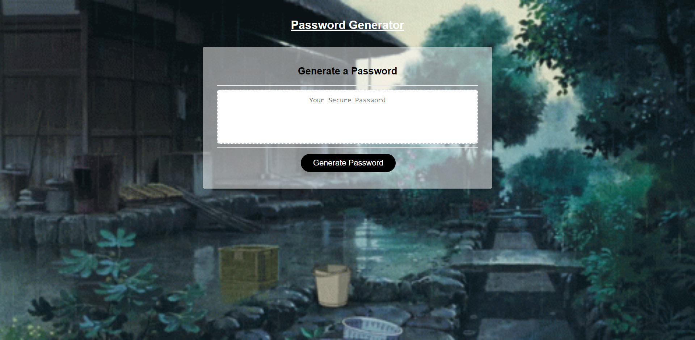

         ____   __   ____  ____  _  _   __  ____  ____     ___  ____  __ _ 
        (  _ \ / _\ / ___)/ ___)/ )( \ /  \(  _ \(    \   / __)(  __)(  ( \
         ) __//    \\___ \\___ \\ /\ /(  O ))   / ) D (  ( (_ \ ) _) /    /
        (__)  \_/\_/(____/(____/(_/\_) \__/(__\_)(____/   \___/(____)\_)__)

## Description
I've created a Password Generator which generates randomized passwords based on a User chosen critera.

Mainly coded in JavaScript with the addition of some basic HTML & CSS for certain Web App Styles.

## Usage & Screenshot
Deployed Web Application: [Password Generator](https://miguelmulet.github.io/Password-Generator/)

Screenshot:

